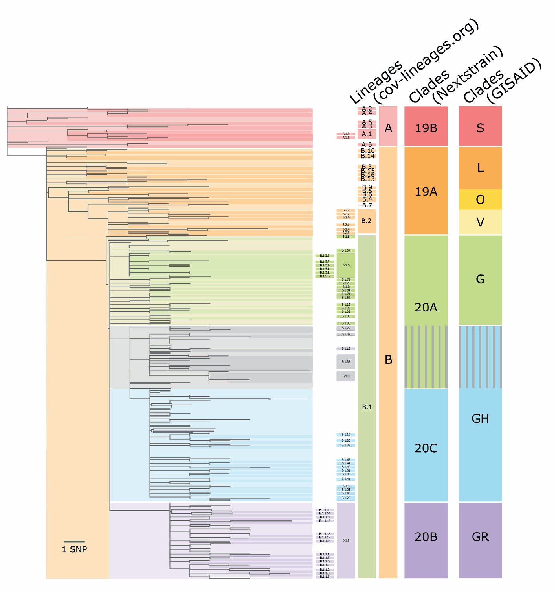

# Exercise03: Genome Assembly

The goals of this exercise are:

    1. to assemble a genome from sequencing reads (SPAdes)
    2. to align assembled genome with reference (MUMMER)
    3. to check the quality of the assembly (Quast)

We selected three tools to use in this exercise.

## Tools for the exercise
### SPAdes: [link for manual](https://github.com/ablab/spades/blob/spades_3.15.1/README.md)
SPAdes is an assembler toolkit containing various assembly pipelines.
In this exercise, you will use the k-mer based assembly module of SPAdes.

### MUMMER: [link for manual](https://mummer4.github.io/manual/manual.html)
MUMMER is a pairwise aligner. It can align:
    - whole genomes to other genomes
    - large genome assemblies to one another
    - partial (draft) genomes sequences to one another
    - or (with release 4) a set of reads to a genome.
Visualization of pairwise alignment can be done by mummerplot.

### QUAST: [link for manual](http://quast.sourceforge.net/docs/manual.html)
QUAST is a quality assessment tool for genome assembly. It evaluates
genome assemblies by computing various metrics including N50.
QUAST can be run as follows:
```sh
./quast.py test_data/scaffolds.fasta
    -r test_data/reference.fasta
    -g test_data/genes.gff
    -o output_dir
```

---

## About the exercise

In this exercise, you will assemble a paired-end sequencing dataset with
three given K values; 21, 77 and 127.

Please submit these files as results:

- three fasta files of scaffolds assembled with SPAdes: `sars_cov_2_k21.fasta`, `sars_cov_2_k77.fasta` and `sars_cov_2_k127.fasta`
- three mums files from MUMMER: `sars_cov_2_k21.mums`, `sars_cov_2_k77.mums` and `sars_cov_2_k127.mums`
- three png files from MUMMERPLOT: `sars_cov_2_k21.png`, `sars_cov_2_k77.png` and `sars_cov_2_k127.png`
- one snps file from MUMMER "show-snps": `sars_cov_2_k127.snps`
- one csv file of assembly metrics: `assembly_result.csv`
- one txt file of clade name: `clade_name.txt`

To submit your result, follow these steps:

- Step 1. Clone this template repository to your working directory and execute "setup.sh"
- Step 2. Fill in the command used in the command0X.sh in the "command" directory. The commands should generate the result of step 3. The result can either be printed to the terminal or written to a file.
- Step 3. Save the result files for each command.
- Step 4. Add edited files to git and commit
   ```sh
   git add .
   git commit -m "COMMIT MESSAGE"
   ```
- Step 5. Submit your answers by pushing the changes.
   ```sh
   git push origin master
   ```

---

## command01.sh
1. Download the fasta file from link and save it as **NC_045512.2.fasta** in the data directory (No result file).
   This file will be used as SARS-Cov-2 reference genome in this exercise.
   - Link: 'https://www.ncbi.nlm.nih.gov/search/api/sequence/NC_045512.2/?report=fasta'

2. Download [paired-end sequencing](https://www.biostars.org/p/267167/) reads as **SRR13668359_1.fastq.gz**
   and **SRR13668359_2.fastq.gz** in the data directory (No result file)
   - Link for Read 1: ftp://ftp.sra.ebi.ac.uk/vol1/fastq/SRR136/059/SRR13668359/SRR13668359_1.fastq.gz
   - Link for Read 2: ftp://ftp.sra.ebi.ac.uk/vol1/fastq/SRR136/059/SRR13668359/SRR13668359_2.fastq.gz

   > You don't have to uncompress the downloaded files.

3. Download GTF file of SARS-Cov-2 and unzip it as **sars_cov_2.genes.gtf** in the data directory. (No result file)
   - Link: ftp://ftp.ensemblgenomes.org/pub/viruses/gtf/sars_cov_2/Sars_cov_2.ASM985889v3.101.gtf.gz


## command02.sh
1. Assemble downloaded sequence reads with SPAdes three times with these k values; 21, 77, and 127
   Save the result to each output directory.
   - INPUT: `SRR13668359_1.fastq.gz`, `SRR13668359_2.fastq.gz`
   - OUTPUT DIRECTORY:
       - k = 21 `./sars_cov_2_k21`
       - k = 77 `./sars_cov_2_k77`
       - k = 127 `./sars_cov_2_k127`
   > The command for executing SPAdes is explained in the slides and the [manual](https://github.com/ablab/spades/blob/spades_3.15.1/README.md)
   > Please specify the output directory by adding "-o" option.
   > Please run SPAdes with "--only-assember" option to speed up.

2. Copy three scaffolds.fasta files to the result directory and name them as sars_cov_2_kXX.fasta. (Result files: **sars_cov_2_kXX.fasta**)
   You can copy files with [cp](https://en.wikipedia.org/wiki/Cp_(Unix)) command. The usage of "cp" command is quite similar to "mv" command.


## command03.sh
1. Align the reference genome and scaffolds assembled with SPAdes with MUMMER.
   Save the output of MUMMER as **sars_cov_2_kXX.mums** in result directory. (Result files: **sars_cov_2_kXX.mums**)
   - INPUT: `NC_045512.2.fasta`, `sars_cov_2_kXX.fasta`
   - OUTPUT: `sars_cov_2_kXX.mums`

2. Visualize the alignment result with mummerplot.
   Save the output plot as **sars_cov_2_kXX.png** in the result directory. (Result files: **sars_cov_2_kXX.png**)
   - INPUT: `sars_cov_2_kXX.mums`, `NC_045512.2.fasta`, `sars_cov_2_kXX.fasta`
   - OUTPUT: `sars_cov_2_kXX.png`

3. Generate snp report for **sars_cov_2_k127.fasta** and save the snp report as
   **sars_cov_2_k127.snps** in the result directory. (Result file: **sars_cov_2_k127.snps**)
   - INPUT: `NC_045512.2.fasta`, `sars_cov_2_k127.fasta`
   - OUTPUT: `sars_cov_2_k127.snps`
   > You can use the "show-snps" command from MUMMER. Please refer to the slides from lectures.

4. With the SNPs, it is possible to find out which clade this virus belongs to.
   The SNPs of SARS-Cov-2 clades are saved at `./data/clade/` named with the clade names
   given by [Nextstrain](#Nextstrain).

   Find out the shared SNPs between the clade and the **sars_cov_2_k127** assembly.
   You can use either **join.awk** from [the slide](https://docs.google.com/presentation/d/1q9Q4JlILb7BSTeaX5qq1R_86kRXRUtKEdTnyeo05a8k/edit#slide=id.gbd3930e5d6_0_684), or "join" command to find if two files have identical join fields.
   With the SNPs, find the clade which shares most SNPs with the **sars_cov_2_k127** assembly.
    and save the name of clade to
   **clade-name.txt** in the result directory. (Result file: **clade-name.txt**)

   - INPUT: `sars_cov_2_k127.snps`, `./data/clade/*.txt`
   - OUTPUT: `clade_name.txt`

   The clade SNP file is formatted as follows:
   ```sh
   # 19A.txt
   14408	C
   8782	C
   ```
   The first column is the position of the SNP in the reference genome and
   the second column is the alternate allele of the SNP.

   The SNP report from MUMMER is formatted as follows:
   ```sh
   1|   PATH_TO/REFERENCE.fasta PATH_TO/QUERY.fasta
   2|   NUCMER
   3|
   4|   [P1]	[SUB]	[SUB]	[P2]	[BUFF]	[DIST]	[R]	[Q]	[CTX R]	[CTX Q]	[FRM]	[TAGS]
   5|   241	C	T	203	203	203	0	0	ATCTAGGTTTCGTCCGGGTGT	ATCTAGGTTTTGTCCGGGTGT	1	1	NC_045512.2	NODE_1_length_29851_cov_400.428644
   ```
   The first column is the position of the SNP in the reference genome and the second column is the allele from the reference sequence. The third column is the alternate allele found from the query sequence
   and the fourth column is the position of the SNP in the query genome. You can find the detail of format
   [here](https://mummer4.github.io/manual/manual.html).

   > If two or more clades tie, select the clade with less clade-specific SNPs.
   > Clade-specific SNPs mean that SNPs which is in the clade and not in the SNPs of assembly.

   > If you use 'join' command, please sort the input files before running the command.
   > [link](https://www.gnu.org/software/coreutils/manual/html_node/Sorting-files-for-join.html#Sorting-files-for-join)
   ```sh
   sort -k 1b,1 file1 > file1.sorted
   sort -k 1b,1 file2 > file2.sorted
   join file1.sorted file2.sorted > file3
   ```
   > As the first 4 lines of `sars_cov_2_k127.snps` cannot be joined with SNPs,
   > you may create a sorted copy of `sars_cov_2_k127.snps` without first 4 lines.

   > You can use 'join' with '-a' option to show the lines which is not joined.
   ```sh
   join -a 1 file1.sorted file2.sorted # print unpairable lines in file1.sorted
   join -a 2 file1.sorted file2.sorted # print unpairable lines in file2.sorted
   ```

## command04.sh

1. Quast is a quality assessment tool for genome assembly. Run Quast for
   **sars_cov_2_k21.fasta**, **sars_cov_2_k77.fasta** and **sars_cov_2_k127.fasta**.
   For each K, save the result at **"./sars_cov_2_k*/quast"**. (No result file)

   - INPUT: `sars_cov_2_k21.fasta`, `NC_045512.2.fasta`, `sars_cov_2.genes.gtf`
   - OUTPUT: `./sars_cov_2_kXX/quast`

2. Among the output of Quast, find "report.pdf" and get these values of the assemblies:
   1. Number of contig
   2. N50
   3. GC-content percentage of assembly.
   Fill in the numbers of the **"assembly_result.csv"** in the result directory with metrics found. (Result file: **assembly_result.csv**)
---

## Nextstrain

Nextstrain is an open-source project of tracking the pathogen evolution with its genome data.
For the SARS-Cov-2, Nextstrain suggested a clade naming strategy in Jun 2020,
and updated it in Jan 2021. [link](https://virological.org/t/updated-nextstain-sars-cov-2-clade-naming-strategy/581)


