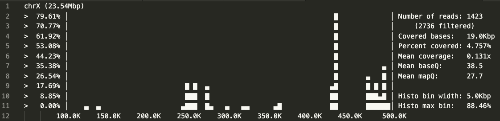

# Exercise04: Gene finding & read mapping

The goals of this exercise are:

   - **Gene finding in prokaryotic genome**
      1. *de novo* gene finding (Prodigal)
      2. mapping newfound proteins with known protein databases (MMseqs2)
   - **RNAseq read mapping**
      1. mapping RNA-seq reads to reference genome (Hisat2)
      2. handling and visualizing alignment files (SAMtools)
      3. transcript assembly and quantification (StringTie)

## Tools for the exercise

### Prodigal: [link for manual](https://github.com/hyattpd/prodigal/wiki)
Prodigal is a quick and unsupervised protein-coding gene prediction tool for prokaryotic genomes.
Prodigal predicts translation initiation sites and partial genes as well as protein-coding genes and handles draft genomes and metagenomes.

### MMseqs2: [link for manual](https://mmseqs.com/latest/userguide.pdf)
MMseqs2 (Many-against-Many searching) is a software suite to search and cluster
huge sequence sets. MMseqs2 reaches the same sensitivity as BLAST magnitude faster and which can also perform profile searches like PSI-BLAST but also 400 times faster.

In this exercise, we are going to use `createdb`, `easy-search`, and `easy-taxonomy` pipeline.

We will use **Swissprot** for protein database and Swissprot is a curated protein
sequence database with a high level of annotation.

The `easy-search` searches directly with a FASTA/FASTQ file against either another
FASTA/FASTQ file or an already existing MMseqs2 target database.

With `easy-taxonomy` pipeline, you can identify the taxonomy of unknown sequences.
MMseqs2 uses seqTaxDBs, which are sequence databases augmented with taxonomic information.
By identifying homologs through searches against a seqTaxDB, it can compute the [lowest common ancestor](https://en.wikipedia.org/wiki/Lowest_common_ancestor)
of the query sequence. This lowest common ancestor is a robust taxonomic label for the unknown sequence.

### HISAT2 : [link for manual](http://daehwankimlab.github.io/hisat2/manual/)
HISAT2 is an alignment program for mapping NGS reads (whole-genome, transcriptome, and exome sequencing data) against the general human population (as well as against a single reference genome).
- Input
   - hisat2 index for the reference genome
   - Sequencing read files (usually paired-end; _1.fastq, _2.fastq)
- Output
   - Alignment in SAM format

### SAMtools: [link for manual](http://www.htslib.org/doc/samtools.html)
Samtools is a set of utilities that manipulate alignments in the SAM (Sequence Alignment/Map), BAM, and CRAM formats. It converts between the formats, does sorting, merging and indexing, and can retrieve reads in any regions swiftly.

In this exercise, we are going to use sub-commands `view`, `index`, `sort` and `coverage`.

### StringTie: [link for manual](https://ccb.jhu.edu/software/stringtie/index.shtml?t=manual)
StringTie is a fast and efficient assembler of RNA-Seq alignments into potential transcripts.
- Input: BAM file with RNA-Seq read mappings (must be sorted)
- Output
   - GTF file containing the assembled transcripts
   - Gene abundances in tab-delimted format (TSV)

---

## About the exercise

This exercise consists of two parts; **gene finding** and **RNA-seq**.

In the first gene finding part, you will find protein-coding genes from an unknown prokaryotes genome and identify the bacterial strain with its proteins.

In the second part, you will map reads from RNA-seq to Drosophila genome and quantify the transcript abundances.

---

## **Part 1. Gene finding**

## command01.sh

1. Find protein-coding genes from `./data/unknown_bacteria.fasta` with **Prodigal**.
Save the FASTA file of putative proteins to `./data/unknown_bacteria.proteins.faa` and the GTF file to `./data/unknown_bacteria.gtf`. (No result file)
> FASTA files can handle both nucleotides and amino-acids sequences.
> To distinguish the two, we often use `.fna` extension for nucleotides and
> `.faa` extension for amino-acids ([FASTA format wikipedia](https://en.wikipedia.org/wiki/FASTA_format))
- Input: `./data/unknown_bacteria.fasta`
- Output: `./data/unknown_bacteria.proteins.faa`, `./data/unknown_bacteria.gtf`

2. Count the number of proteins in `unknown_bacteria.proteins.faa` and save the count to `./result/unknown_bacteria.protein.count.txt`.
(Result file: **unknown_bacteria_protein_count.txt**)


## command02.sh

1. Download and setup **Swiss-Prot** database for **MMSeqs** in the `./db` folder. (No result file)

2. **MMseqs2** provides `easy-search` workflow to search a FASTA file against target databases.

   Run `easy-search` workflow for `unknown_bacteria.proteins.faa` against **Swiss-Prot** and save the result as `./result/unknown_bacteria.proteins.aln.swissprot.tsv`.

   (Result file: **unknown_bacteria.proteins.aln.swissprot.tsv**)

   The columns of output **must be arranged in this order**:
      - Query sequence identifier
      - Target sequence identifier
      - E-value
      - Alignment length
      - Cigar string
      - Taxon name
      - Header of Target sequence

   > Please use `--format-output` option.

   > Use `./tmp` as a temporary folder.

   - Input: `./data/unknown_bacteria.proteins.faa`, Swiss-prot database in `./db`, `./tmp`
   - Output: `./result/unknown_bacteria.proteins.aln.swissprot.tsv`

3. Run **Mmseqs2** `easy-taxonomy` workflow for `unknown_bacteria.proteins.faa` and save the
   results with the prefix `./result/unknown_bacteria.taxonomy`.

   Identify the strain of the unknown genome with `./result/unknown_bacteria.taxonomy_report` and
   fill in `./result/unknown_bacteria.strain.csv`.

   This is current version of `unknown_bacteria.strain.csv` and please fill in these
   by splitting the scientific name of the identified strain. The `taxonomy_id` is the
   taxonomy identifier value provided by the `easy-taxonomy` report.

   taxonomy_id | genus_name | species_name | strain
   ------------|------------|--------------|--------
   0           | unknown    | unknown      | unknown

   (Result files: 4 result files from `easy-taxonomy` and **unknown_bacteria.strain.csv**)

   - Input: `./data/unknown_bacteria.proteins.faa`, Swiss-prot database in `./db`, `./tmp`
   - Output
      - `./result/unknown_bacteria.taxonomy_lca.tsv`
      - `./result/unknown_bacteria.taxonomy_report`
      - `./result/unknown_bacteria.taxonomy_tophit_aln`
      - `./result/unknown_bacteria.taxonomy_tophit_report`
      - `./result/unknown_bacteria.strain.csv` (Please fill in the scientific name of the strain)

4. Repeat `easy-search` workflow analysis with `./data/unknown_transcripts.fasta` as in Step 2.
   Save the result as `./result/unknown_transcripts.aln.swissprot.tsv` and save the
   best matched Swiss-prot IDs of two transcripts to `./result/unknown_transcripts.proteins.csv`

   transcript_name          | swissprot_id
   -------------------------|-------------
   transcript_from_vaccine1 | unknown
   transcript_from_vaccine2 | unknown

   (Result files: `./result/unknown_transcripts.aln.swissprot.tsv`, `./result/unknown_transcripts.proteins.csv`)

   - Input: `./data/unknown_transcripts.fasta`, Swiss-prot database in `./db`, `./tmp`
   - Output
      - `./result/unknown_transcripts.aln.swissprot.tsv`
      - `./result/unknown_transcripts.proteins.csv` (Copy the best hit lines from `./result/unknown_transcripts.aln.swissprot.tsv`)

---

## **Part 2. RNA-seq**

## command03.sh
1. Download the HISAT2 index of Drossophila genome **"dm6"** to `./db` and extract the `tar.gz` file.
   After extraction, `make_dm6.sh` in the `./db/dm6` folder and remove the downloaded `dm6.tar.gz`.
   (No result file)
   - Link: https://genome-idx.s3.amazonaws.com/hisat/dm6.tar.gz

2. We will use reads from two *D. melanogaster* RNA-seq runs; GSM461177 and GSM461180.
   One sample is from the wild type and the other is from the samples with an RNAi (RNA interference) assay on
   *pasilla* gene.
   Download these FASTQ files in `./data` directory and change the file extensions from `.fastqsanger`
   to `.fastq`. (No result file)
   - https://zenodo.org/record/4541751/files/GSM461177_1_subsampled.fastqsanger
   - https://zenodo.org/record/4541751/files/GSM461177_2_subsampled.fastqsanger
   - https://zenodo.org/record/4541751/files/GSM461180_1_subsampled.fastqsanger
   - https://zenodo.org/record/4541751/files/GSM461180_2_subsampled.fastqsanger

   Output
      - `./data/GSM461177_1_subsampled.fastq`
      - `./data/GSM461177_2_subsampled.fastq`
      - `./data/GSM461180_1_subsampled.fastq`
      - `./data/GSM461180_1_subsampled.fastq`

3. Map the paired-end reads of two samples to **dm6** genome with **HISAT2**.
   Save the alignment result at `./data/GSM461177.sam` and `./data/GSM461180.sam`.
   (No result file)
   - Input
      - `./data/GSM461177_1_subsampled.fastq`, `./data/GSM461177_2_subsampled.fastq`
      - `./data/GSM461180_1_subsampled.fastq`, `./data/GSM461180_1_subsampled.fastq`
   - Output
      - `./data/GSM461177.sam`
      - `./data/GSM461180.sam`

## command04.sh

1. Convert the HISAT2-mapped SAM files to BAM format with `samtools view` command. (No result file)
   - Input: `./data/GSM461177.sam`, `./data/GSM461180.sam`
   - Output: `./data/GSM461177.bam`, `./data/GSM461180.bam`

2. Sort the BAM files from previous step with `samtools sort` command.
   Save the sorted BAM file as `*.sorted.bam`. (No result file)
   - Input: `./data/GSM461177.bam`, `./data/GSM461180.bam`
   - Output: `./data/GSM461177.sorted.bam`, `./data/GSM461180.sorted.bam`

3. Make index files for sorted BAM files from previous step with `samtools index` command. (No result file)
   - Input: `./data/GSM461177.sorted.bam`, `./data/GSM461180.sorted.bam`
   - Output: `./data/GSM461177.sorted.bam.bai`, `./data/GSM461180.sorted.bam.bai`

## command05.sh

1. Download and extract the gzipped GTF file of *D. melanogaster* from the link.

   - Link: ftp://ftp.ensembl.org/pub/release-103/gtf/drosophila_melanogaster/Drosophila_melanogaster.BDGP6.32.103.gtf.gz

   **Convert the chromosome names** of downloaded GTF file to have **"chr"** at the beginning.
   > e.g., 3R --> chr3R

   Save the GTF file as `./data/d_melanogaster.genes.gtf`. (No result file)

   - Ouput: `./data/d_melanogaster.genes.gtf`

2. Assemble and quantify transcripts for `./data/GSM461177.sorted.bam` and `./data/GSM461180.sorted.bam` with **StringTie**. Save the output files to the `result` folder. (Result files: **StringTie output**)
   - Input
      - BAM files
         - `./data/GSM461177.sorted.bam`
         - `./data/GSM461180.sorted.bam`
      - Guide GTF file: `./data/d_melanogaster.genes.gtf`
   - Output
      - GTF files for assembled transcripts
         - `./result/GSM461177.gtf`
         - `./result/GSM461180.gtf`
      - TSV files for gene abundances
         - `./result/GSM461177.tsv`
         - `./result/GSM461180.tsv`

3. This is the information of *pasilla* gene.

   FlyBase ID  | Symbol | Name    | Species           | Chromosome | Start   | End
   ------------|--------|---------|-------------------|------------|---------|--------
   FBgn0261552 | ps     | pasilla | *D. melanogaster* | chr3R      | 9417940 | 9455500

   Find the FPKM and TPM of *pasilla* gene in two TSV files and fill in the `./result/pasilla.csv`.

   (Result file: **pasilla.csv**)

   - Input: `./result/GSM461177.tsv`, `./result/GSM461180.tsv`
   - Output: `./result/pasilla.csv` (Fill in the FPKMs and TPMs)

4. You can visualize the coverage of specific region with `samtools coverage`.
   
   Run `samtools coverage` for *pasilla* gene in `GSM461177.sorted.bam` and `GSM461180.sorted.bam`
   and save the ASCII-art histograms as. `./result/*.pasilla.coverage`.
   > Please use **80** for `-w` option.
   - Input
      - `./data/GSM461177.sorted.bam`
      - `./data/GSM461180.sorted.bam`
   - Output:
      - `./result/GSM461177.pasilla.coverage`
      - `./result/GSM461180.pasilla.coverage`

   With the results from Step 3 and 4, find the sample with RNAi experiment on *pasilla* gene
   and save the sample ID (**GSM461177** or **GSM461180**) to `./result/sample_with_RNAi.txt`.

   (Result files: **GSM461177.pasilla.coverage**, **GSM461180.pasilla.coverage**
    and **sample_with_RNAi.txt**)

5. Get top 5 highly expressed genes (based on TPM) from `./result/GSM461177.tsv` and `./result/GSM461180.tsv`.
   Save the lines of top 5 genes to `./result/GSM461177.top5.tsv` and `./result/GSM461180.top5.tsv`.

   (Result files: **GSM461177.top5.tsv**, **GSM461180.top5.tsv**)

   > Only consider genes with gene names (Ignore transcripts of which gene names are "-")

   > [Sort](https://man7.org/linux/man-pages/man1/sort.1.html) command will be helpful.

   > `*_top5.tsv` should not include the header lines.

## command06.sh
Differential Expression (DE) analysis is one of the most common types of analyses
when you work with RNA-seq data. Usually, we use public R libraries for DE analysis,
such as [DESeq2](https://bioconductor.org/packages/release/bioc/html/DESeq2.html) or
[edgeR](https://bioconductor.org/packages/release/bioc/html/edgeR.html).
Although the normalization steps which is done with these libraries are important
in the DE analyses, we are going to do a quick and easier (also not normalized)
version of DE analysis in this exercise.

1. Join the `./result/GSM461177.tsv` and `./result/GSM461180.tsv` with the `Gene ID` column.
   Only consider genes with gene names (Ignore transcripts of which gene names are "-").
   (No result file)
   - Input: `./result/GSM461177.tsv`, `./result/GSM461180.tsv`
   - Output: Joined tsv file

   > You may use `join` command or `join.awk` from `exercise03`.

2. [Fold change](https://en.wikipedia.org/wiki/Fold_change) is the ratio of the
   expression of particular gene in condition 1 and 2 and we commonly use the log2 (base-2 logarithm)
   value of fold change in DE analysis. To prevent division by zero errors,
   pseudocounts are added to the denominator and numerator when calculating the fold change.

   ```
   log2_fold_change = log2((expression_from_condition1 + pseudo_count) / (expression_from_condition2 + pseudo_count))
   ```

   From the joined tsv file, calculate the log2 fold change of all genes between
   wild-type sample and the *pasilla* RNAi sample and find the top 25 genes and bottom 25 genes
   based on log2 fold change. Save the top 25 genes and their log2 fold change to
   `./result/pasilla.log2FC.top25.csv` and those of bottom 25 genes to `./result/pasilla.log2FC.bottom25.csv`.
   (Result files: **pasilla.log2FC.top25.csv** and **pasilla.log2FC.bottom25.csv**)
   Write the **gene names as column 1** and the **log2 fold change as column 2** like this:
   ```
   gene1,3.5
   gene2,3.4
   ...
   ```
   For the calculation, use **TPM** values and **1** as psuedocount.

   > AWK has a `log()` function for calculating natual logarithm.

   > You may generate intermediate files.

   > You can use [sort](https://man7.org/linux/man-pages/man1/sort.1.html) command for
   sorting log2 fold change values.

---

## Submission

To submit your result, follow these steps:

- Step 1. Clone this template repository to your working directory and execute "setup.sh"
- Step 2. Fill in the command used in the command0X.sh in the "command" directory. The commands should generate the result of step 3. The result can either be printed to the terminal or written to a file.
- Step 3. Save the result files for each command.
- Step 4. Add edited files to git and commit
   ```sh
   git add .
   git commit -m "COMMIT MESSAGE"
   ```
- Step 5. Submit your answers by pushing the changes.
   ```sh
   git push origin master
   ```

Please submit these files as results:

- Number of proteins predicted with Prodigal: **unknown_bacteria_protein_count.txt** (command01.sh)
- MMseqs2 alignment results:
   - **unknown_bacteria.proteins.aln.swissprot.tsv** (command02.sh - Step 2.)
   - **unknown_transcripts.aln.swissprot.tsv** (command02.sh - Step 4.)
- MMseqs2 easy-taxonomy result (command02.sh - Step 3.)
   - **unknown_bacteria.taxonomy_lca.tsv**
   - **unknown_bacteria.taxonomy_report**
   - **unknown_bacteria.taxonomy_tophit_aln**
   - **unknown_bacteria.taxonomy_tophit_report**
- Name of the unknown strain: **unknown_bacteria.strain.csv** (command02.sh - Step 3.)
- Proteins from the unknown transcripts: **unknown_transcripts.proteins.csv**
- StringTie output (command05.sh - Step 2.)
   - **GSM461177.gtf**, **GSM461180.gtf**, **GSM461177.tsv**, **GSM461177.tsv**
- FPKM and TPM values of *pasilla* gene: **pasilla.csv** (command05.sh - Step 3.)
- Histograms for *pasilla* gene region (command05.sh - Step 4.)
   - **GSM461177.pasilla.coverage**, **GSM461180.pasilla.coverage**
- Sample ID with RNAi: **sample_with_RNAi.txt** (command05.sh - Step 4.)
- Top 5 highly expressed genes: **GSM461177.top5.tsv**, **GSM461180.top5.tsv** (command05.sh - Step 5.)
- Top and bottom 25 DE genes: **pasilla.log2FC.top25.csv** and **pasilla.log2FC.bottom25.csv** (command06.sh)
